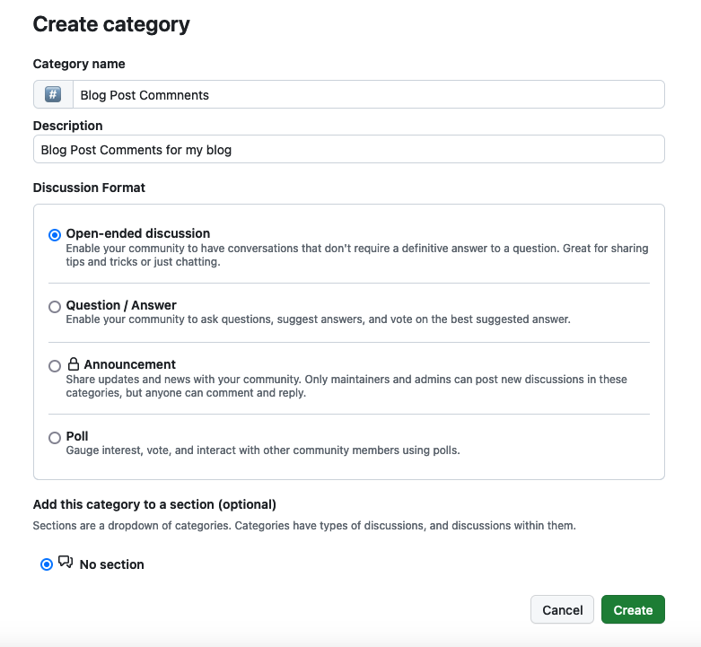
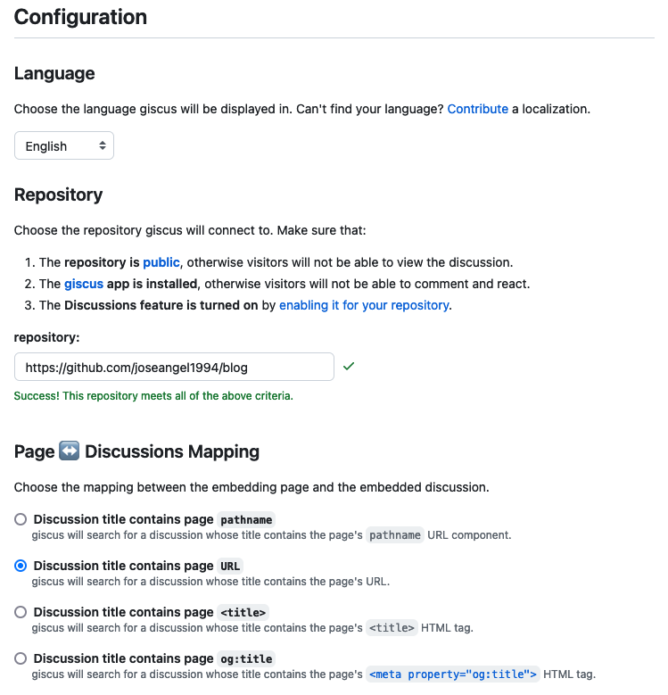
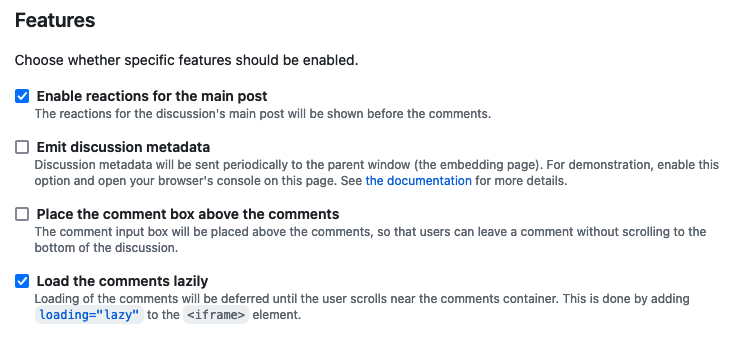
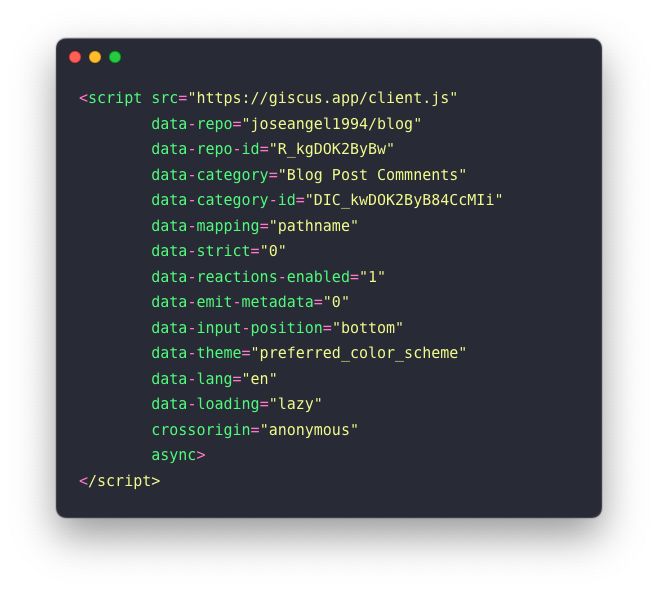
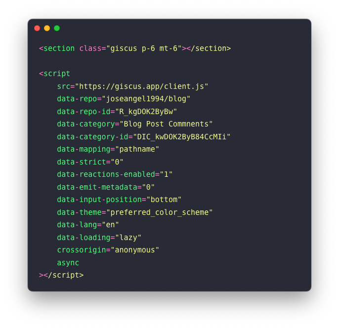
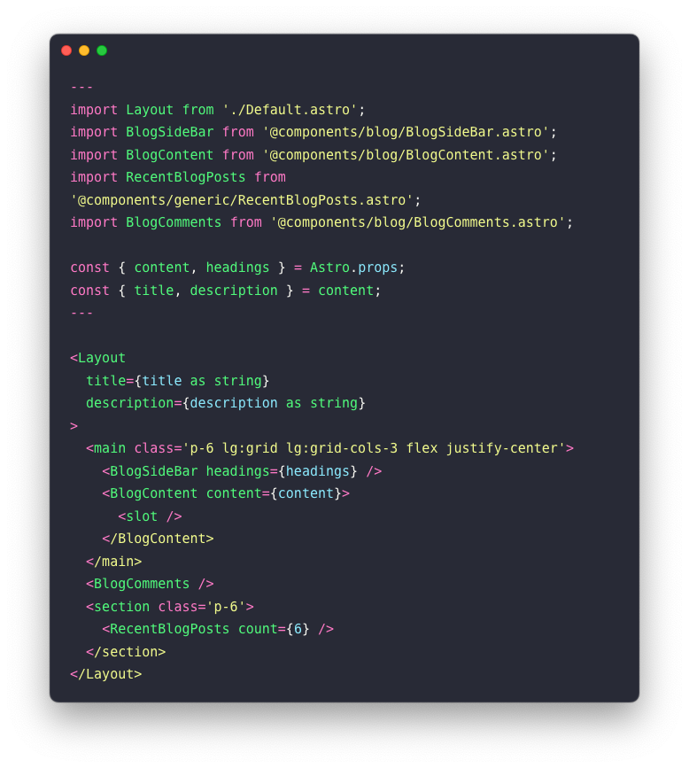

Having a comments section in a blog post is the perfect way to receive feedback from readers, gather ideas for future posts, or even identify errors in what has been written.

If you're using an existing platform to publish your blog, such as Medium, WordPress, or a similar one, the comment system will likely come built-in. However, in the case of this blog, which uses Astro, it can be a bit more complicated. Astro is a static site generator, and the content is stored in Git in Markdown files.

After some research, I found Giscus, an app that allows adding comments to posts using GitHub Discussions. In this post, we'll explore how to configure and add it to this blog so you can provide your feedback.

## First, why Giscus?

Giscus, fueled by GitHub Discussions, serves as a comment system enabling readers to post comments and reactions on any website through GitHub. It comes at no cost and doesn't need any database or authentication system. Your comments will be securely stored in GitHub Discussions, providing you with complete control over your data.

## Set up the config

Now that we know what Giscus is, it's time to configure it properly to display comments on blog posts. For this, the repository containing the blog must meet the following requirements:

1. The repository should be public
2. The giscus app is installed on GitHub
3. The Discussions Feature is enabled on the repository
4. Create category for blog comments

The first point is quite simple, as it involves checking the visibility of the GitHub repository where the blog's code is hosted.

To meet the second point, you need to install the [Giscus](https://github.com/apps/giscus) bot within GitHub and grant it permissions to access the chosen repository. This bot will create the discussion the first time someone leaves a comment or reaction after authenticating on GitHub.

To enable the Discussion Feature, simply go to GitHub, click on ⚙️ **Settings**, navigate to **Features**, and check **Discussions**.

Finally, let's create a new category for Discussions to handle blog comments. To do this, within the repository, go to **Discussions**, and in the left menu, next to **Categories**, click on the pencil icon. This will take you to another page where you'll find a button to create a new category. Once clicked, fill in the following information:

Once all these steps are completed, you can check in the Giscus app if your repository is ready by simply copying the repository URL and pasting it into the available field. If everything is correct, a Success message will appear, allowing you to proceed with the final configuration touches.

n the Discussions Mapping section, you need to select the option "Discussion title contains page URL" to ensure each comment is correctly linked to the corresponding blog entry. For the category, choose the category you created earlier on GitHub, i.e., "Blog Post Comments." Regarding the Features section, you can check the options you prefer. In my case, I've chosen the following:

And there you have the steps needed to configure Giscus. In the end, you'll get a snippet to add to your code, something similar to this:

## Adding Giscus to the blog

Now that we have the Giscus configuration ready, let's add the comments section to the blog. There are many ways to do this, but the one I've chosen is to create a component called `BlogComments` and include the snippet obtained in the previous step there:

Now, import this component within the BlogPost layout and add it to the bottom of the page:

Done! The comments section should now appear within the blog, and on GitHub, in the Discussions section under Blog Post Comments, you should also see the same comments and reactions.

## Conclusion

As you have seen, using the Astro framework to create a blog does not limit you when it comes to having features like the comments section. Thanks to tools like Giscus, we can achieve the same functionality. By following a few simple steps, we configured Giscus and learned to use the Discussions feature of GitHub, which, at least for me, was unknown until writing this post. Every day is an opportunity to learn something new!

