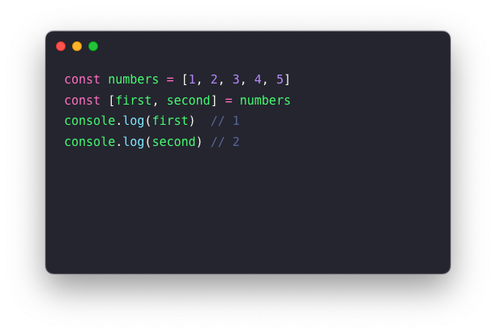
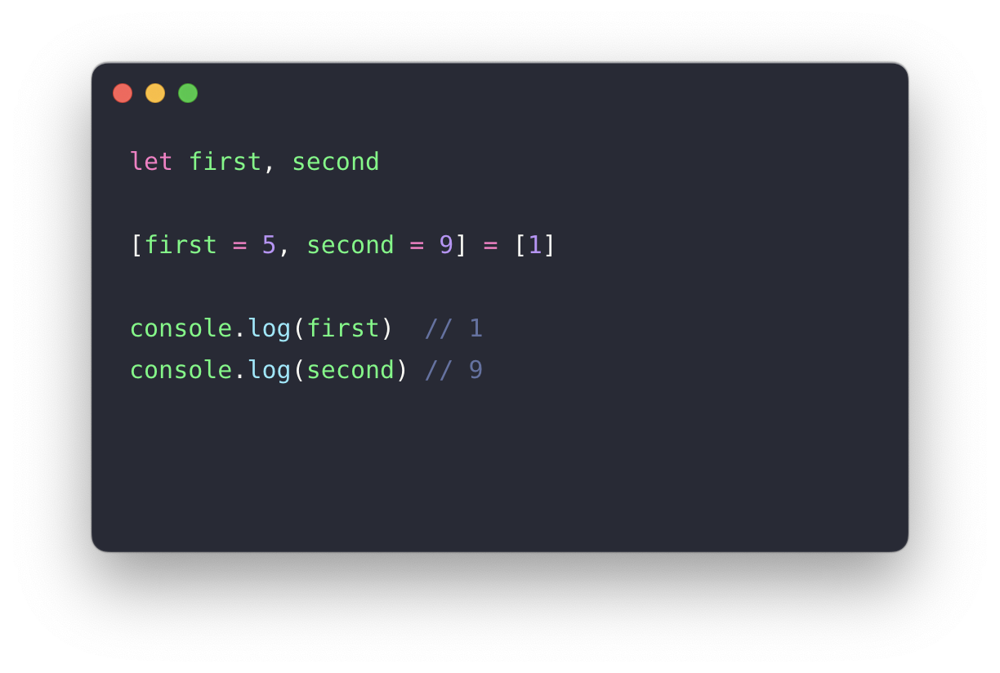
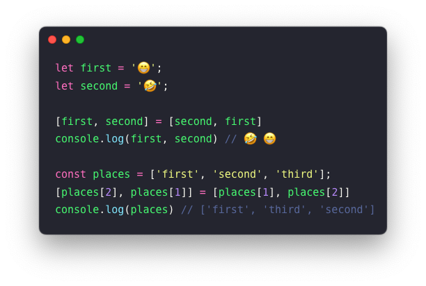
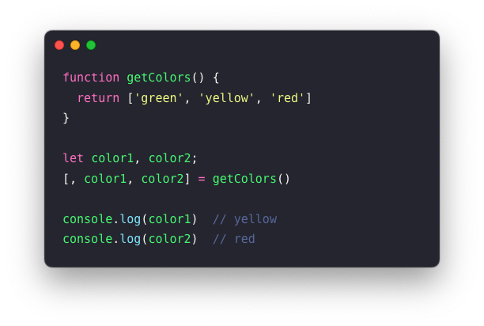
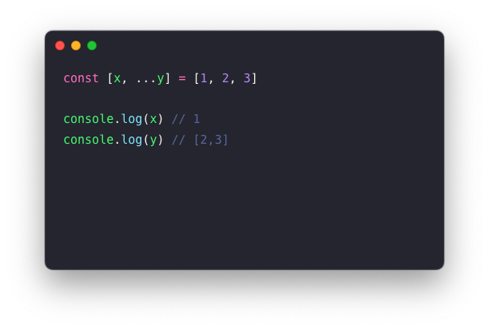
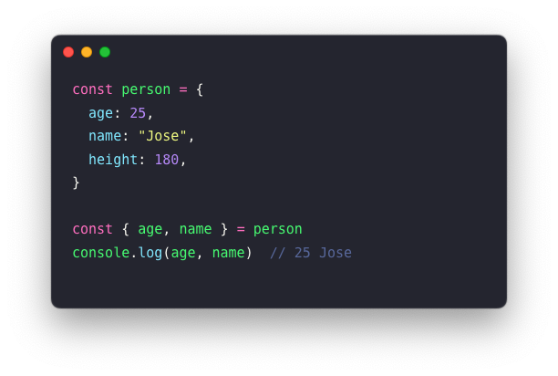
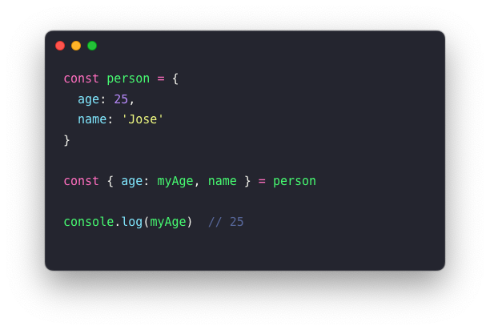
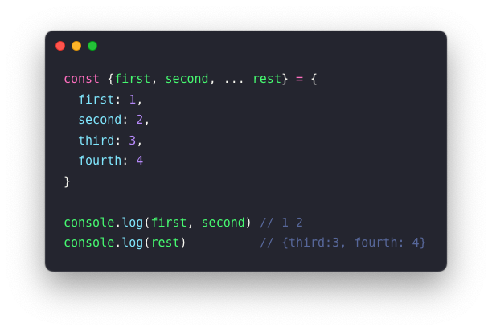
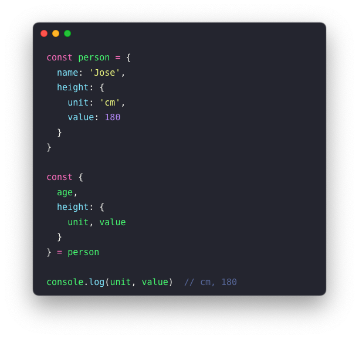
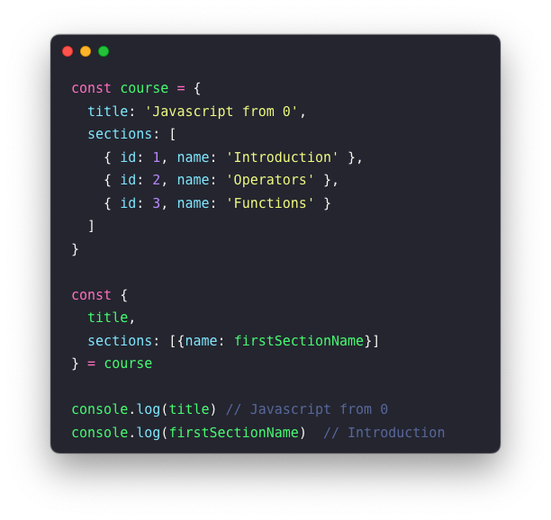

In this post, I will talk about the concept of destructuring assignment and its application in simplifying data extraction in JavaScript. The destructuring syntax is nothing more than a JavaScript expression that enables the extraction of data, whether from arrays or properties of any object, into one or multiple new variables.

### Why use Destructuring?

Destructuring is one of the most innovative features introduced in ES6. Its adoption leads to cleaner and clearer code, making it significantly more readable and intuitive, only with a slight increase in coding complexity. Destructuring enables various interesting operations, such as assigning default values, swapping variables, or extracting data from nested objects.

### Destructuring in Arrays

There are several ways to extract data from an array, with the simplest being something like ```let data = array[0]```. While effective, it becomes more complicated when extracting multiple values at once. By applying destructuring, we can specify which set of values we want to extract from the array, as follows:


If we access a position in the array that does not exist, we'll get an undefined value. To prevent this, we can assign a default value to each variable we intend to use in the extraction. Please note here that another valid approach for performing this assignment is by declaring the variables before extracting the data:

As mentioned earlier, a very useful application of destructuring is variable swapping, allowing us to exchange the values of two variables without the need for an auxiliary variable. In this case, as we are using array literals and they could be interpreted as property access, the use of semicolons is needed. Below, I provide a couple of examples:

It's not uncommon to encounter a function in our code that returns an array. By applying destructuring, we can "parse" or extract the values from that array into the variables we need in just one line. And what if we didn't want the first value? Easy, we ignore it by using a comma in the corresponding position, leaving the space empty without the need to define a third variable.

The next functionality uses an operator introduced with ES6, known as the spread operator or rest operator. Its syntax is quite simple, involving placing three dots (...) before the variable you are using it with. We can use this operator when applying destructuring if we want to assign the rest of an array to a variable (keeping in mind that this operator should be used in the last position when applying destructuring):


### Destructuring in Objects

Just as we've seen with arrays, now let's explore how destructuring can also be applied to objects in a straightforward manner. It's as simple as using curly braces and including the property names we need from the object:

Just as we did with arrays, we can assign the value of a variable on a different line than its declaration, or set default assignments to protect ourselves from potential undefined values. Here are two things to consider: the use of () is mandatory since the assignment could be confused with a code block, and the preceding line must be terminated with a ';' to avoid confusion with a function. The correct form would be as follows:

Another functionality is giving an "alias" to one or several variables when applying destructuring to an object. This can be quite useful when the names of the object properties we receive are not as descriptive as they should be:

In object destructuring, we can also use the spread operator (also called rest operator when applied in destructuring) seen earlier:

It's not uncommon in our daily work to encounter objects whose properties are other nested objects. As expected, destructuring allows us to extract data from these nested objects:

To conclude, now that we've seen how destructuring can significantly simplify our work with arrays and objects, let's explore an example demonstrating how destructuring can be combined and applied to nested arrays and objects:


### Conclusion

In this post, I've summarized some functionalities of the destructuring syntax, which allows us to extract data from arrays and objects with great flexibility, cleanliness, and clarity. Since its introduction in ES6, while not necessary for simple objects, it has become the most powerful and valuable feature of JavaScript when dealing with extraction from complex objects or arrays.

